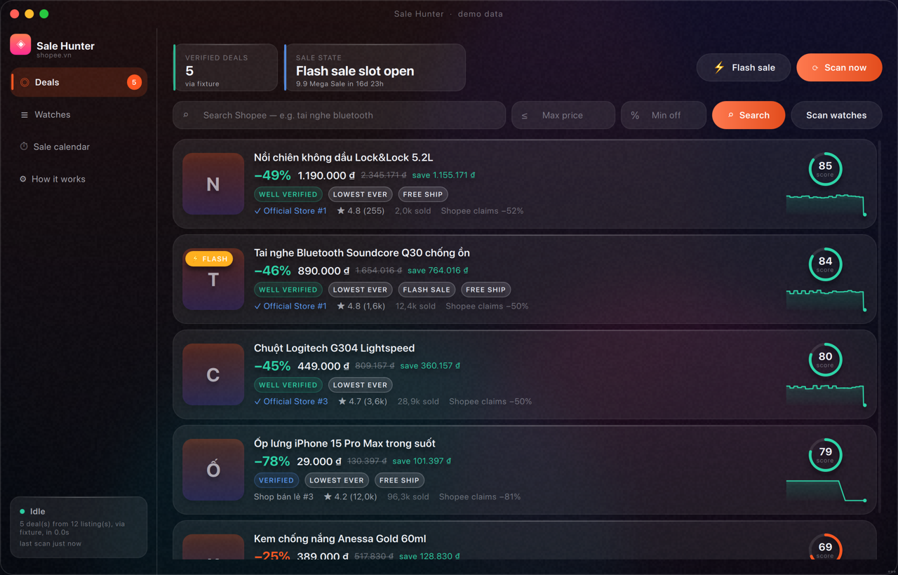
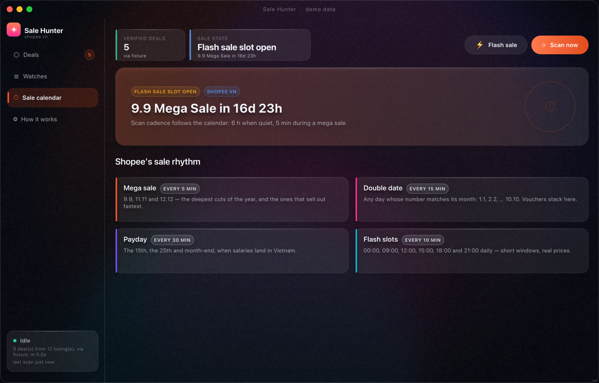

# Sale Hunter

A desktop app for **Windows and macOS** that hunts genuinely discounted items on Shopee during
sale days — and tells you when a "-70%" is not one.



<sub>Running on demo data. Note the fourth row: Shopee claims −81%, the observed history says
−78%, and the badge says `verified` rather than `well verified` because the listing is new.
Regenerate every view with `python scripts/ui_screenshot.py`.</sub>

## The problem it solves

Every Shopee listing carries its own discount badge, and the seller controls both numbers.
The dominant pattern during a sale is a permanent "-50%" against an "original" price nobody
has ever paid. So a price tracker that repeats Shopee's percentage does not just fail to
help — it actively recommends the fakest listings, because those claim the biggest discounts.

Sale Hunter compares today's price against **the median of what that exact listing has
actually sold for** over the last 90 days, excluding flash prices. A drop is real when the
history says so; when Shopee's claim is much bigger than the observed drop, the deal is
flagged *inflated claim* and does not count as genuine. Every card shows how much evidence
there is behind its verdict — `well verified`, `verified`, `thin history`, `unverified` —
because on a fresh install there is no history yet, and saying so is better than inventing a
number.

## What it does

- **Watches** — keyword, price ceiling, minimum *real* discount, rating floor, excluded words
  ("op lung, cuong luc" removes the phone cases from an "iphone 15" search).
- **Sale-day cadence** — the scan interval follows Shopee's own rhythm: 6 h on a quiet day,
  30 min on payday, 15 min on a double date (1.1 … 12.12), 5 min during a mega sale
  (9.9 / 11.11 / 12.12), and it tightens an hour before a big window opens. Flash-sale slots
  (00, 09, 12, 15, 18, 21) are covered too.
- **Local price history** — one SQLite file on your machine. Nothing is uploaded anywhere.
- **Desktop notifications** for a new deal above your score threshold, announced once rather
  than at every scan.
- **A UI that is meant to be looked at** — frameless translucent window, real OS blur where
  the platform offers it, an animated gradient background, GPU-driven motion, and *identical
  rendering on Windows and macOS* because Qt Quick draws every pixel itself.

## Install and run

Requires Python 3.11–3.13.

```bash
git clone git@github.com:osirisQdt2810/shopee-hunter.git
cd shopee-hunter
python3.13 -m venv .venv && source .venv/bin/activate     # Windows: .\.venv\Scripts\activate
pip install -e ".[dev]"
python -m shopee_hunter --demo        # a full app on offline demo data, no setup
```

`--demo` is the fastest way to see what it does: a seeded catalogue with real price history
behind it, so every verdict and badge is exercised without touching the network.

## Getting real data out of Shopee (read this part)

Shopee protects its endpoints, and this is the honest state of play:

| Source | How it works | Reality |
|---|---|---|
| `affiliate` | Official signed Open/Affiliate API | Stable and sanctioned. Needs approved keys, and its catalogue is narrower than site search. |
| `browser` | Opens the real search page in a browser profile you log into, and reads the response Shopee's own JavaScript receives | **The one that works.** Needs the `[browser]` extra and a one-time sign-in. |
| `web` | Plain HTTPS to `/api/v4/*` | Works only with cookies pasted from a logged-in browser, and not always then. |

**Measured on 2026-08-23, from a residential IP with no session:** every anonymous request to
`shopee.vn` search is refused. Plain HTTP gets `HTTP 403`. A real browser — headless *and*
headful — gets redirected to `/verify/traffic/error?…&is_logged_in=false`, and the search API
answers `error: 90309999`. That is not a bug in this app and not something a User-Agent
fixes: **shopee.vn requires a signed-in session to search.**

So the working setup is one sign-in:

```bash
pip install -e ".[browser]" && playwright install chromium
```

```toml
# config/secrets.toml   (gitignored)
[sources.browser]
enabled = true
headless = false        # so you can log in
```

```bash
python scripts/live_check.py --keyword "tai nghe bluetooth" --source browser -v
```

A Chrome window opens; sign into Shopee once. The profile is stored locally and reused, so
later runs can set `headless = true`. The app never asks for your Shopee password and never
stores one.

### It scans slowly on purpose

Every request passes a token bucket at ~0.5 req/s with at most two in flight, and a refusal
buys a 120-second cooldown. This is a personal watcher, not a crawler: the realistic worst
outcome is not a missed discount, it is your account getting flagged. There is no turbo
switch, and that is a design decision, not an omission.

## The sale calendar



## Commands

```bash
python -m shopee_hunter                     # run
python scripts/run_dev.py --reload          # run with QML hot-reload while styling
pytest                                      # offline suite (network blocked, ~300 tests)
pytest -m live                               # LIVE: real Shopee + a real window (opt-in)
python scripts/live_check.py -k "tai nghe"   # live end-to-end scan in the terminal
python scripts/ui_screenshot.py --out .artifacts/ui   # screenshot every view
pre-commit run --all-files                   # black, ruff, isort, qmlformat, layer check
python packaging/build.py                    # -> dist/ (.app on macOS, .exe on Windows)
```

`live_check.py` reports through its exit code: **0** deals found, **2** Shopee refused us
(a correct outcome — the adapter raised a typed error instead of pretending there were no
deals), **1** a real bug.

## How it is built

```
src/shopee_hunter/
  core/      pure logic — no Qt, no HTTP, no sqlite. The deal engine, the sale calendar,
             the token bucket, the settings tree. Tested in milliseconds.
  sources/   every way of reading Shopee, behind ONE adapter contract. Wire parsing is a
             pure function pinned by captured fixtures.
  storage/   SQLite. Price history is load-bearing, not a cache.
  services/  orchestration: scan, schedule, notify.
  gui/       Qt + QML only, holding no business rule. One Theme singleton owns every colour,
             radius, duration and easing.
```

Imports go one way (`core` ← `sources|storage|services` ← `gui`), and that is enforced by
`tests/test_architecture.py` and a pre-commit hook rather than by good intentions. The
architectural decisions and their trade-offs are written down in
[`.claude/DECISIONS.md`](.claude/DECISIONS.md) — start with ADR-002 (why QML, not QWidgets),
ADR-004 (the adapter chain) and ADR-005 (what counts as a discount).

## Legal

For personal use. You are responsible for complying with Shopee's Terms of Service in your
jurisdiction. The app uses your own session from your own machine, rate-limits itself
conservatively, and stores nothing off your device — but it is still a tool that reads a site
programmatically, and that is your call to make.

## License

MIT.
